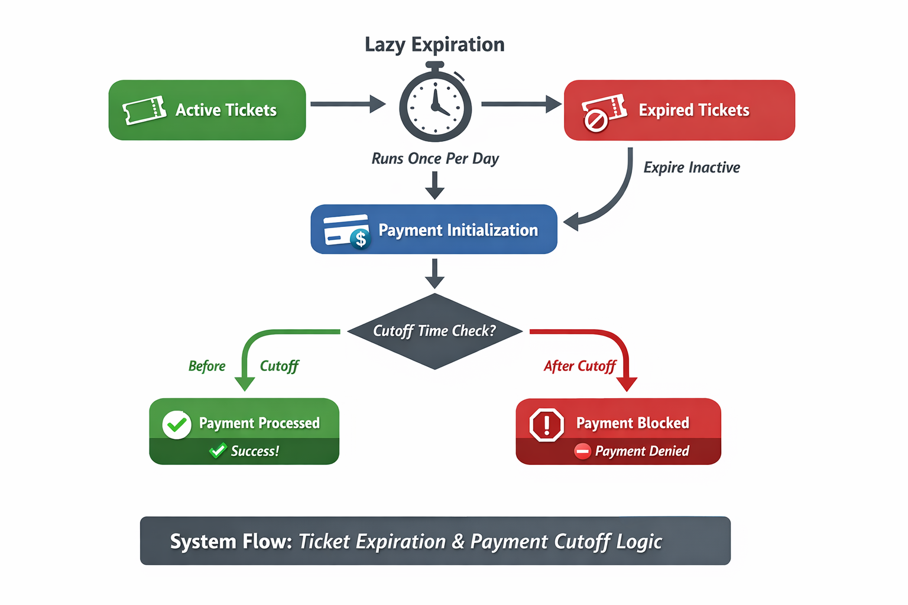

# Payment & Ticket Flow System

This repository/module implements a **ticket lifecycle and payment processing system** with a focus on **lazy expiration** and **payment cutoff logic**. The system ensures tickets expire automatically and enforces cutoff times before payment processing.

---

## Table of Contents

- [Overview](#overview)
- [Ticket Lifecycle](#ticket-lifecycle)
- [Payment Flow](#payment-flow)
- [Lazy Expiration Mechanism](#lazy-expiration-mechanism)
- [Cutoff Time Check](#cutoff-time-check)
- [Key Lessons & Design Considerations](#key-lessons--design-considerations)

---

## Overview

The system handles:

1. Ticket creation and management.
2. Automatic expiration of tickets **once per day** via a lazy check.
3. Payment initialization while respecting ticket expiration and payment cutoff rules.
4. **Area-based ticket validation** — tickets are tied to the driver's registered area and can only be verified by agents assigned to the same area.

It is optimized to **avoid unnecessary database operations** when no expired tickets exist.

---

## Ticket Lifecycle

Tickets move through the following states:

1. **Active** – Newly created, valid for today.
2. **Inactive** – Past `valid_for_date`; marked by lazy expiration check.
3. **Revoked** – Manually cancelled by admin.

Each ticket carries the driver's `area` FK at creation time, inherited directly from `payment.driver.area`.

**Notes:**

- Expiration occurs **once per day** when the system checks tickets.
- The system does not rely on a cron job; the lazy check triggers when a payment is being initialized.

---

## Payment Flow

1. User initializes payment via API.
2. The system first checks if there are **any expired tickets** and marks them inactive.
3. Payment cutoff logic is applied:
   - Payments **before cutoff** → processed successfully.
   - Payments **after cutoff** → blocked.
4. Payment is recorded and ticket is associated with the transaction.

---

## Lazy Expiration Mechanism

The lazy expiration approach:

- Runs **once per day**.
- Only updates tickets with `expiry_date < today` and `status = ACTIVE`.
- Avoids running on every request, minimizing DB operations.
- Ensures expired tickets are updated before payment initialization.

---

## Cutoff Time Check

- Payments are only processed **before a defined daily cutoff time**.
- This prevents late payments from being processed outside business rules.
- Integrates seamlessly with lazy expiration to maintain data integrity.

---

## Ticket Validation

Agents validate tickets in two ways:

| Method | Endpoint | How |
|---|---|---|
| QR Code | `GET /api/v1/ticket/agents/validate?qr_code=<uuid>` | Scan QR on driver's phone |
| Phone Fallback | `GET /api/v1/ticket/agents/validate/fallback?phone_number=<number>` | Look up today's active ticket by driver phone |

In both cases, the agent's assigned area must match the ticket's area, otherwise a `403` is returned.

---

## Key Lessons & Design Considerations

- **Lazy updates vs cron jobs**: Improved reliability and reduced dependencies on external schedulers.
- **Atomic updates**: Using `.update()` ensures database changes happen efficiently.
- **Defensive coding**: Prevented errors during migrations by skipping operations if tables are unavailable.
- **Area enforcement**: Tickets, drivers, and agents all reference the same `Area` FK — no string comparisons, no mismatch risk.
- **Fallback validation**: Phone number lookup handles QR scanner failures gracefully without compromising area enforcement.

---

## Diagram

---